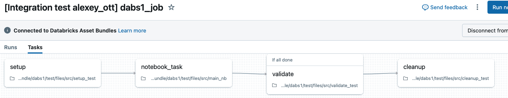

# Integration test example

This DAB shows how to redefine resource on per-target base, emulating wrapping of the code into integration test that has additional tasks.  This is done by overriding the job resource (defined in [resources/dabs1.job.yml](resources/dabs1.job.yml) only in the specific target (`test`, defined in [resources/integration_test.yml](resources/integration_test.yml)) 

## Getting started

1. Install the Databricks CLI from https://docs.databricks.com/dev-tools/cli/databricks-cli.html

2. Authenticate to your Databricks workspace, if you have not done so already:
    ```
    $ databricks configure
    ```

3. To deploy a development copy of this project, type:
    ```
    $ databricks bundle deploy -t dev
    ```
    (Note that "dev" is the default target, so the `--target` parameter
    is optional here.)

    This deploys everything that's defined for this project.  For example, the default
    template would deploy a job called `[dev yourname] dabs1_job` to your workspace.  You
    can find that job by opening your workpace and clicking on **Workflows**.

4. Similarly, to deploy the code into the test environment, type:
   ```
   $ databricks bundle deploy -t test
   ```

   This will deploy a job with name `[Integration test yourname] dabs1_job`, but it will
   have different number of tasks (setup the test, validate results, cleanup):
   
   

5. To run a job or pipeline, use the "run" command:
   ```
   $ databricks bundle run
   ```
